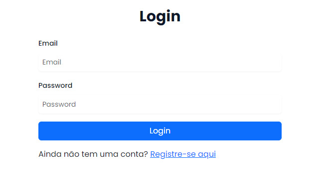
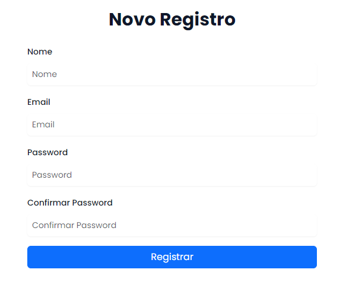
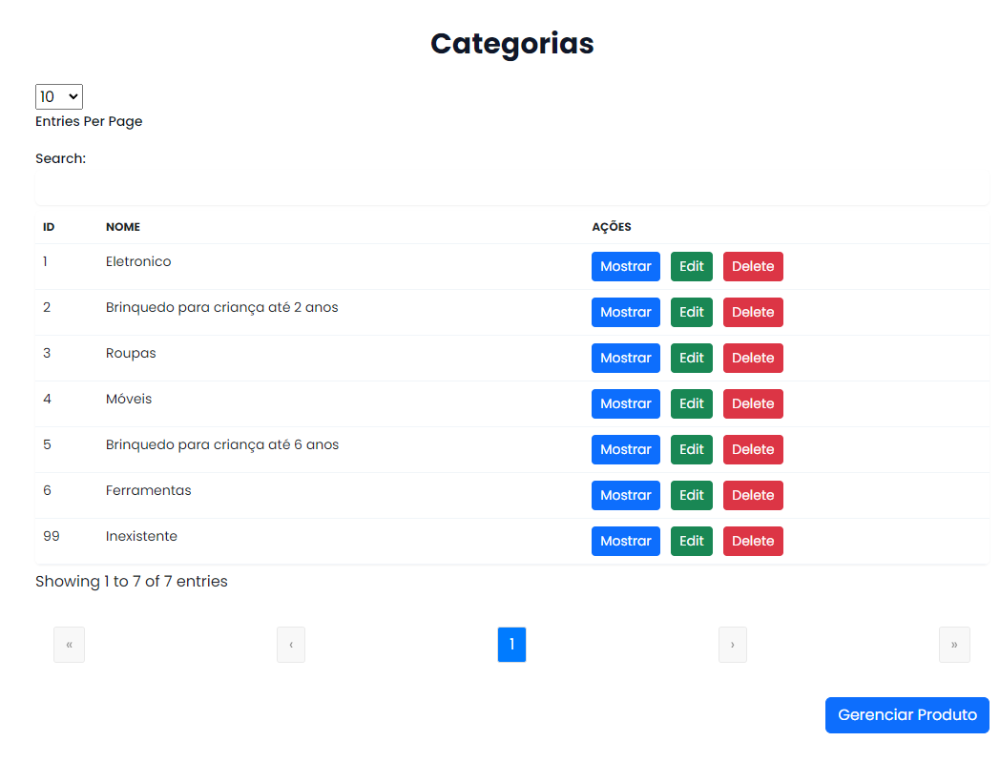
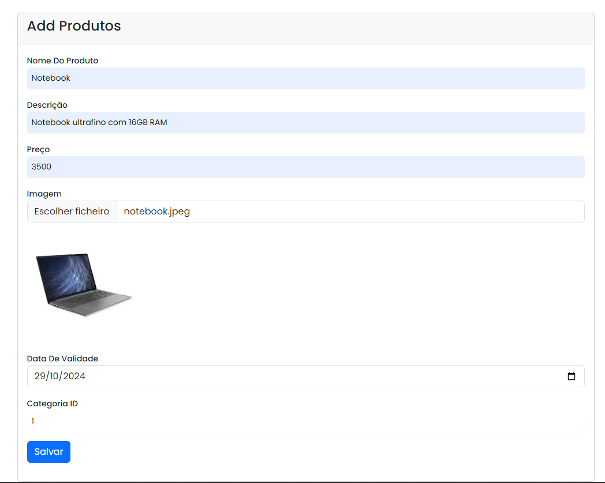

# Projeto

* Este projeto demonstra a integração entre o backend Laravel 11 e o frontend Vue 3, utilizando tecnologias modernas para criar uma aplicação web completa.

# Tecnologias Utilizadas

# Backend:

- Laravel 11: Framework PHP para estrutura e organização do backend.
- MySQL: Banco de dados relacional para armazenamento de dados.

# Frontend:

- Vue 3: Framework JavaScript para construção da interface do usuário.
- Bootstrap: Framework CSS para estilos e componentes visuais.
- Tailwind CSS: Framework CSS utilitário para customização e flexibilidade de design.

# Pré-requisitos

1) Git: Sistema de controle de versão.
2) Composer: Gerenciador de dependências para PHP (Laravel).
3) Node.js e npm: Ambiente de execução JavaScript e gerenciador de pacotes (Vue).
4) MySQL: Banco de dados.

# Instalação

# Backend (Laravel)

1) Clonar o repositório:

Bash

git clone <URL_DO_REPOSITORIO>

2) Instalar dependências:

Bash

cd nome_do_projeto_backend

Bash

composer install

3) Configurar o ambiente:

- Copiar .env.example para .env
- Gerar chave da aplicação: php artisan key:generate
- Configurar as informações de conexão com o banco de dados em .env.

4) Criar o banco de dados:

- Criar o banco de dados no MySQL.

5) Executar as migrations:

Bash

php artisan migrate

# Frontend (Vue)

1) Clonar o repositório:

Bash

git clone <URL_DO_REPOSITORIO>

2) Instalar dependências:

Bash

cd nome_do_projeto_frontend

Bash

npm install

3) Compilar os assets:

Bash

npm run dev 

ou

Bash
npm run build

4) Execução

Iniciar o servidor Backend:

Bash

php artisan serve

Acessar o projeto:

**[Abra o navegador e acesse http://localhost:5173]**

5) Telas

- Login

- Registro

- Categorias

- New Produto

# Contribuição

* Sinta-se à vontade para contribuir com o projeto! Siga estes passos:

1) Faça um fork do repositório.
2) Crie uma branch para sua feature: git checkout -b minha-feature
3) Faça commit das suas alterações: git   
4) commit -am 'Adicionando minha feature'
5) Faça push para a branch: git push origin minha-feature
6) Abra um Pull Request.

# Observações:

1) Substitua <URL_DO_REPOSITORIO_BACKEND> e <URL_DO_REPOSITORIO_FRONTEND> pelas URLs corretas dos seus repositórios.
2) Adapte os comandos e configurações de acordo com a estrutura do seu projeto.
3) Mantenha a documentação atualizada conforme o projeto evolui.

